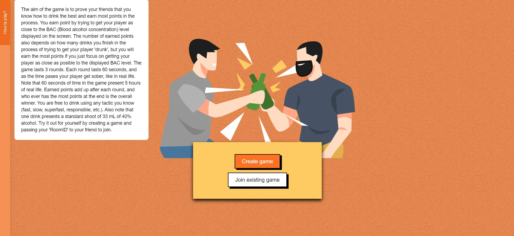
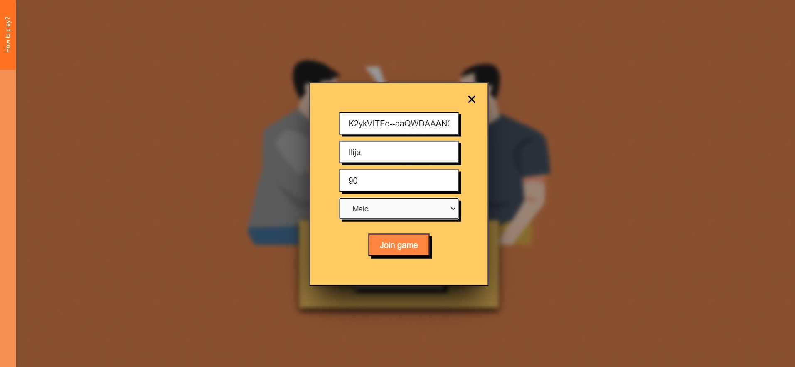
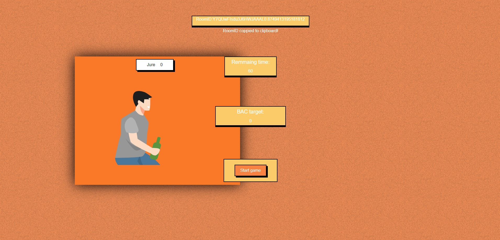
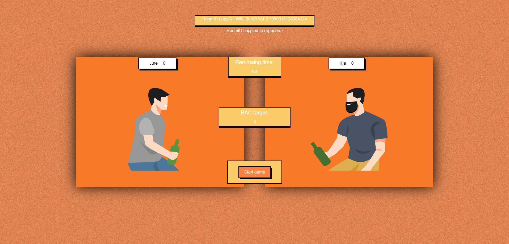

# Drinking game

This is the drinking game that is meant to be played in the browser. It's a multiplayer game where two players fight over who knows how to drink better. At the start of the game, the target BAC level (Blood alcohol concentration) is presented to the players. Player's goal is to try to get their player as close to that BAC level as posible by drinking. Players earn points depending on how close their BAC was to the BAC that was presented on the screen. The game lasts 3 rounds, and who ever has the most points after 3 rounds is the winner. As each round progresses Player's BAC lever lovers down to simulate a player getting sober. 60 second passed on the screen presents 5 hours of real time.

## Table of contents

- [Overview](#overview)
  - [The challenge](#the-challenge)
  - [Screenshot](#screenshot)
  - [Links](#links)
  - [Built with](#built-with)
  - [What I learned](#what-i-learned)
  - [Continued development](#continued-development)
- [Author](#author)

## Overview

### The challenge

These were just the few challenges I faced when building this game:

- Storing all active players
- Creating player lobies which are atonomus for on another
- Keeping track of point earning in all lobbies
- Enableing a player to see on their screen a opponent lifting up the glass if the opponent is drinking
- Calculating BAC level. Lovering it down as the time passes (player getting sober) and highering it up when the player takes a drink
- Making a timer
- Displaying all the data about the players

There are many more issues and challenges that I faced, but these were just the few big ones.

### Screenshot

### Links

- Currently the game isn't hosted anywhere

### Built with

- Semantic HTML5 markup
- CSS custom properties
- Flexbox
- CSS Grid
- Tailwind
- Mobile-first workflow
- React
- Redux
- Node.js
- Socket.IO
- Express
- Figma

### What I learned

I personally learned a ton while doing this project. This was my first project using MERN stack. I previously used Python and Flask, but I didn't have many experience with JavaScript frameworks. In the process I learned React (at least a part of it). I learned how to use different hooks like useState and useEffect. We also used Redux, so I needed to get along pretty well with that too.

For the client and server communication we used Socket.io web socket library. That allowed as to have two way communication which makes making an interactive game like this much easier than if we used the standard one way communication.

### Continued development

At first I tought this will be a relativly simple project, but it ended up very complex, even though we (me and my friend Ilija) didn't add many features that we planned at the beginning. Since both me and Ilija are students, we have limited time to work on project like this, but will definitely not abandon this project and will continue making it better.

## Authors

Jure Reljanović

- LinkedIn - [Jure Reljanović](https://www.linkedin.com/in/jure-reljanovi%C4%87-57b6291a8/)
- Website - (in the process)

Ilija Mihajlović

- LinkedIn - [Ilija Mihajlović](https://www.linkedin.com/in/ilija-mihajlovic-18942b253/)
- Website - [ilija-mihaljovic.com](https://ilija-mihajlovic.netlify.app/)
